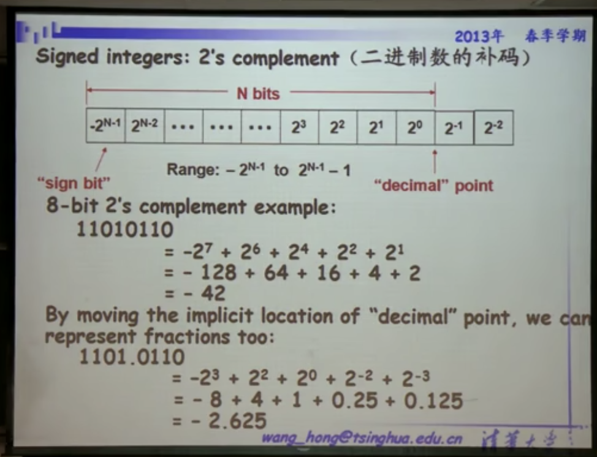
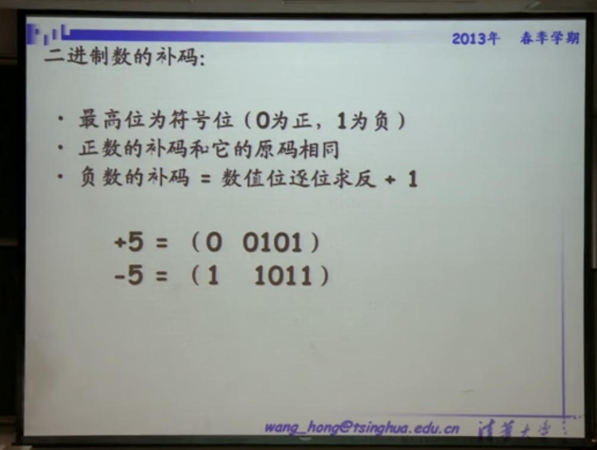
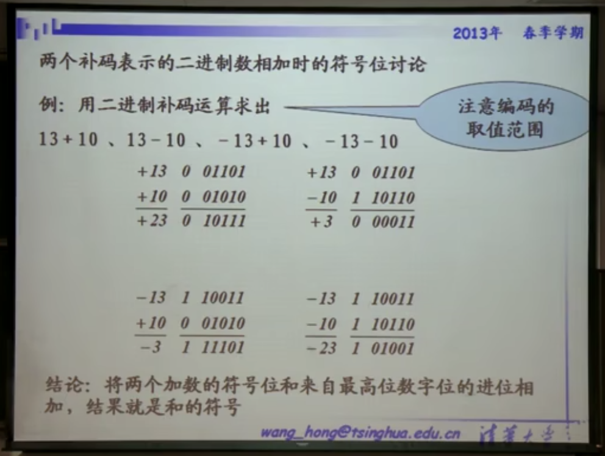
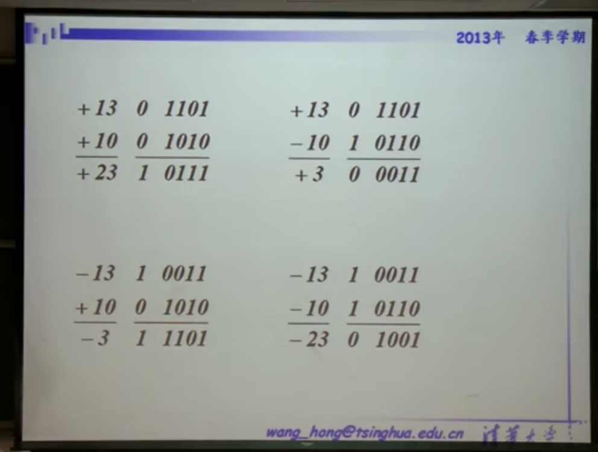
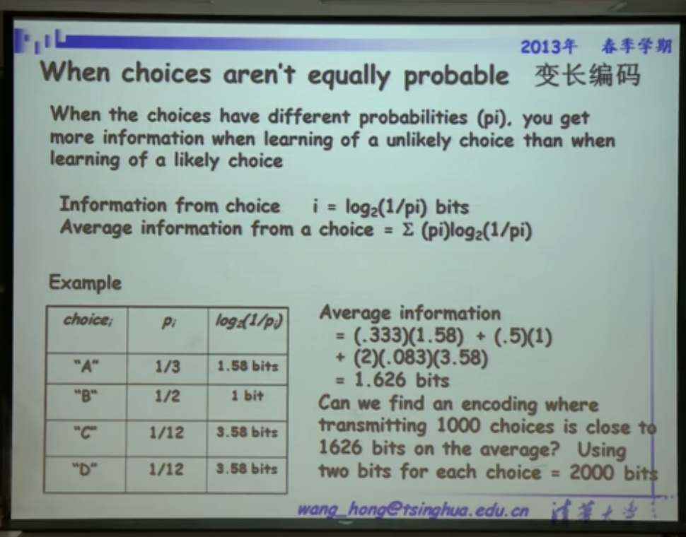

视频1和视频2和视频3的24:00之前
# 1. 进制转换

* $(101.11)_B = 1 \times 2^2 + 0 \times 2^1 + 1 \times 2^0 + 1 \times 2^{-1} +1 \times 2^{-2} =(5.74)_D$

* $(2A.7F)_H = 2 \times 16^1 + 10 \times 16^0 + 7 \times 16^{-1} + 15 \times 16^{-2} = (42.4960937)_D$

所以任意进制转换到十进制如下：

* $D = \sum K_i N^i$

# 2. 数制

## 2.1 二进制补码

关于正负：负的数字就是将最高位的数字变为1

从上面可以看出，负数只需要将正数的对应位置取反再**在最后一位+1（如果是小数是在小数的最后+1，因为本质是为了溢出）**。因为取反之后正负相加一定会导致一列1111...的数字，然后+1导致整个数字溢出，于是回0.

### 2.2 examples:

#### 2.2.1 example1:
* 六位的二进制补码能表达的数字范围是-32～31  

    * 因为最高位要表达正负，所以能表示数字的只有5位。
    * $2^5 = 32$, 所以有32种不同的排列组合，但是对于正数最高位是0，所以正数只能表达到31。而负数最高位是1，所以可以表达到-32.

#### 2.2.2 example2:

#### 2.2.3 example3: 计算时位数要选对不然会计算错误。下面的就是计算错误了。

# 2. 码制

## 2.1 变长编码
通过数字出现的频率来编码，将经常出现的编码短一些，不经常的长一些。
